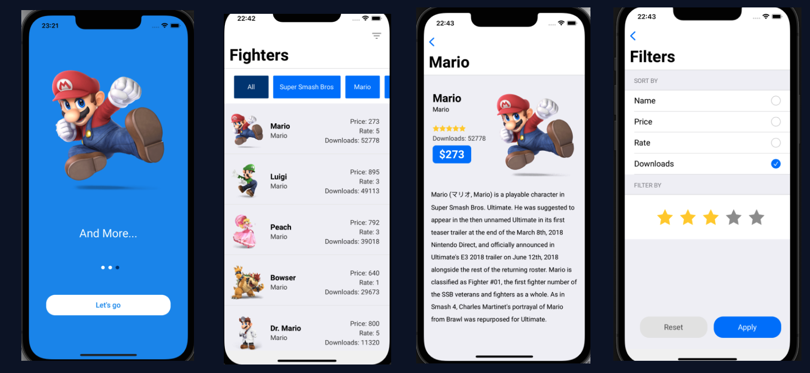
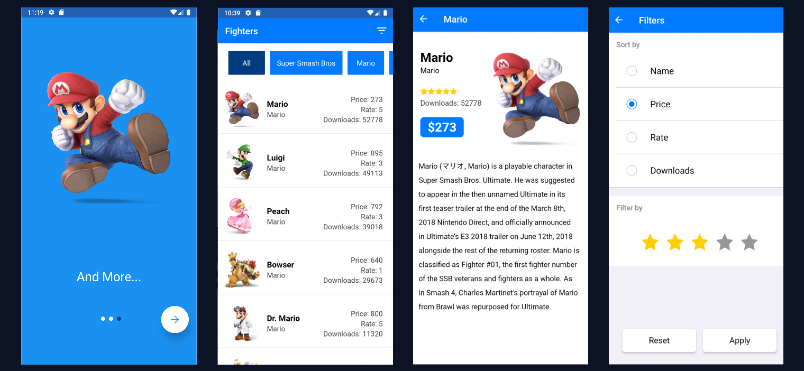

<h1 align="center">
  🚀 Fighters World
</h1>

  

  
  
  

  

  

  <a href="#rocket-technologies">Technologies</a>&nbsp;&nbsp;&nbsp;|&nbsp;&nbsp;&nbsp;
  <a href="#-projects-description">Project's Description</a>&nbsp;&nbsp;&nbsp;|&nbsp;&nbsp;&nbsp;
  <a href="#memo-license">License</a>

 

  
  

 

## :rocket: Technologies

This project was developed mainly with the following technologies

- [React Native](https://facebook.github.io/react-native/)
- [Typescript](https://www.typescriptlang.org/)
- [Redux Toolkit](https://redux-toolkit.js.org/)
- [Styled Components](https://styled-components.com/)

## 💻 Project's Description

- Find your favorite fighters from multiple game universes such as Mario, Zelda, Donkey Kong, Smash Bros, Pokemon and many others. You can also filter them using the filters available.

## 🎮 Start

- Step 1: Run command `yarn or npm install` to install project's dependencies. If you are using MacOs, also run `pod install` inside ios folder;

- Step 2: Run command `yarn android or yarn ios` to install the application on your emulator;

Obs: In case you don't have your environment configured to run an emulator [click here](https://reactnative.dev/docs/environment-setup) and follow the steps on React Native's documentation.

## 🤖 APK

APK available [click here](https://drive.google.com/file/d/1nVahUTMQeNwLtA5sjZ3Ya2imt2XswcE1/view?usp=sharing)

## :memo: License

This project is under MIT license. Check the license file [LICENSE](LICENSE.md) for more details.

---

Developed by Arthur Dionízio during Koombea recruiting process [Get in touch](https://www.linkedin.com/in/dionart)
